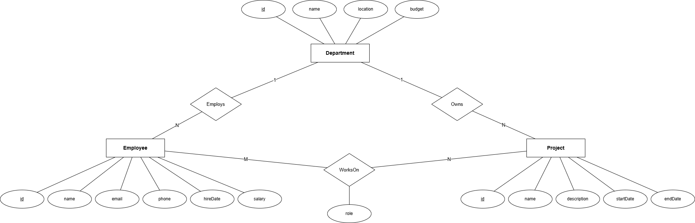
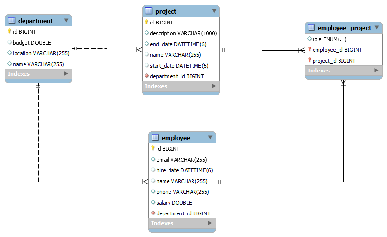

# Tech_Assess-EMS

## Table of Contents

- [Overview](#overview)
- [Features](#features)
  - [Entity Relationship Diagram (ERD)](#entity-relationship-diagram-erd)
  - [Class diagram](#class-diagram)
  - [Swagger Documentation](#swagger-documentation)
  - [App Pages](#app-pages)
- [Technologies Used](#technologies-used)
  - [Backend](#backend)
  - [Frontend](#frontend)
- [Getting Started](#getting-started)
- [Contributors](#contributors)

## Overview

A web-based Employee Management System that allows users to manage
employee records, departments, and project assignments within an organization.

## Features

The system supports the following operations:

- Create new departments with name, location, and budget information
- View all departments in the system
- Update department information
- Delete departments (only if no employees are assigned)
- Add new employees with personal information (name, email, phone, hire date, salary)
- Assign employees to departments
- View all employees or filter by department
- Update employee information
- Remove employees from the system
- Create projects with name, description, start date, and end date
- Assign multiple employees to a project
- Assign projects to departments
- View all projects or filter by department
- Update project details
- Delete projects
- An employee can be assigned to multiple projects
- A project can have multiple employees
- Track the role of each employee in each project (e.g., Developer, Manager, Analyst)
- View all projects for a specific employee
- View all employees working on a specific project

### Entity Relationship Diagram (ERD)

## 

### Class diagram

## 

### Swagger Documentation

#### Employee Controller

#### Project Controller

#### Employee Project & Department Controllers

## 

### App Pages

#### Departments Page

##### Departments list

##### Create Department

## 

#### Employees Page

##### Employees list

##### Create Employee

## 

#### Projects Page

##### Projects list

##### Create Project

## 

#### Employee Projects Page

##### Employee Projects list

##### Assign Employee to Project

## Technologies Used

### Backend

- **Java 25**
- **Spring Boot 4**
- **Spring Data JPA**
- **Hibernate**
- **PostgreSQL**
- **Jakarta Bean Validation**
- **OpenAPI & Swagger UI**
- **Lombok**
- **Maven**
- **ModelMapper**

### Frontend

- **Angular**
- **TypeScript**
- **Bootstrap**
- **Standalone Components**
- **Signals**
- **Angular Router**
- **Reactive Forms**
- **Lazy Loading**

## Getting Started

To get started with the Employee Management System project, follow the setup instructions in the respective directories:

- [Backend Setup Instructions](backend/README.md)
- [Frontend Setup Instructions](frontend/README.md)

## Contributors

- [Mustafa Zayed](https://github.com/Mustafa-Zayed)
